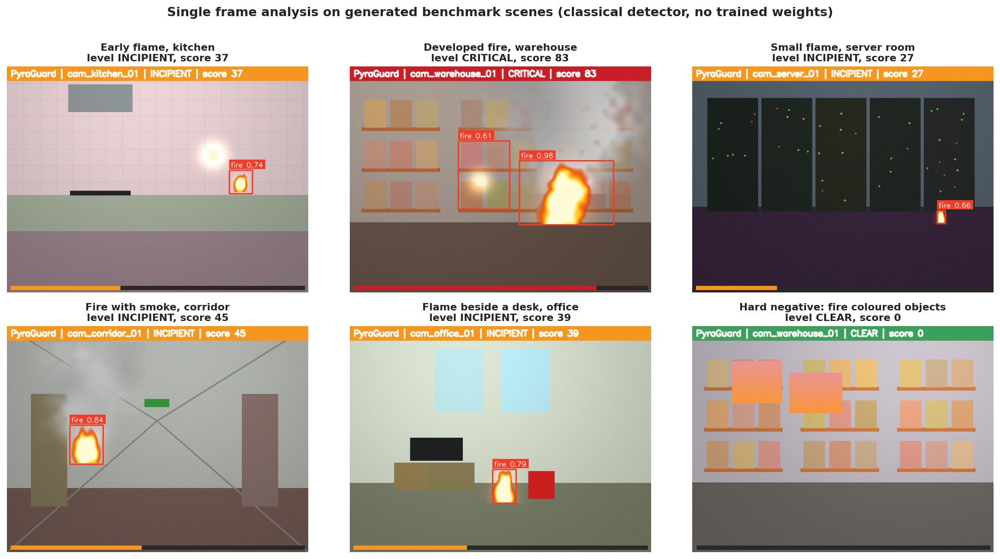
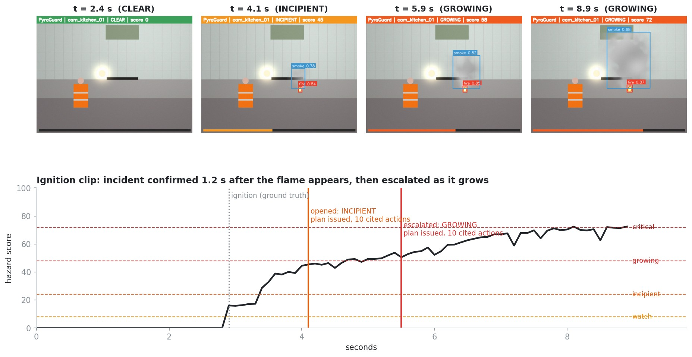
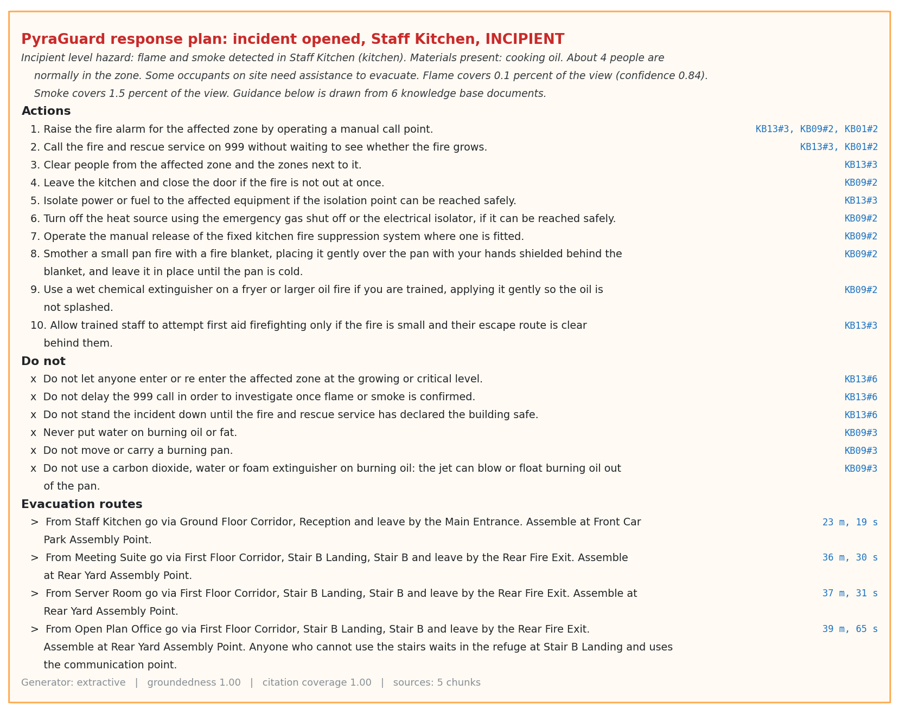
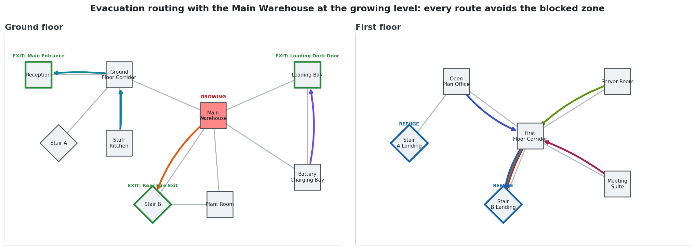
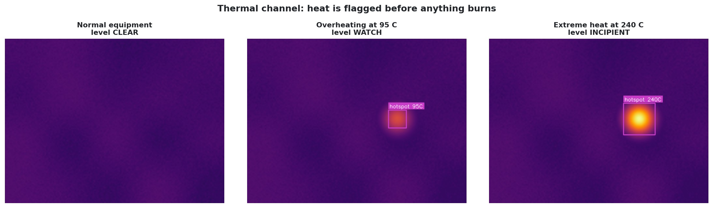
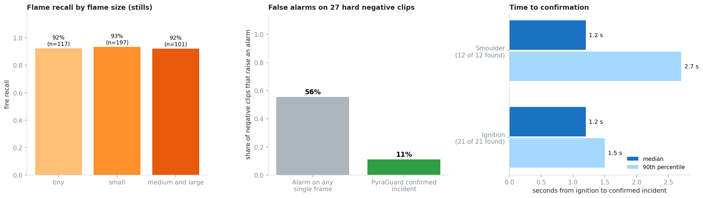
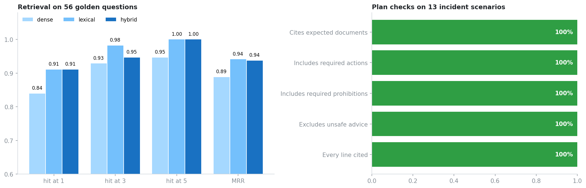

# PyraGuard AI

**Autonomous Early Stage Thermal Hazard Identification & Evacuation Intelligence via Multimodal RAG and Vision AI**

PyraGuard AI watches camera feeds for flame, smoke and abnormal heat, confirms a hazard over time rather than on a single frame, and then answers the question an alarm never answers: what should the people on site do right now. Every instruction it issues is retrieved from a reviewed fire safety knowledge base and carries a citation to its source.


## Project Brief

Fire is a problem of time. A fire in ordinary furnishings or packaging can double in size in well under a minute once it takes hold, which means the value of a detection system is set almost entirely by how early it speaks. Conventional point detectors speak late by design: they sit on the ceiling and wait for smoke or heat to reach them. In a tall warehouse or an atrium, smoke can cool and spread out below the roof before it ever arrives at a detector, while conditions at floor level still look normal. Yet most commercial buildings already have cameras looking directly at the places where fires start. A camera sees the flame at its source, in the first seconds, wherever it is in view. That unused field of view is the opportunity this project addresses.

Detection, however, is only half of the problem, and arguably the easier half. When an alarm sounds, the person in the control room has seconds to decide what to tell people, and the correct answer depends on details that are easy to get wrong under stress. Water thrown on burning cooking oil produces a fireball. Water or foam on live electrical equipment risks electric shock. A lithium ion battery in thermal runaway must not be picked up and carried outside. A burning gas leak should not be extinguished unless the supply can be shut off. The guidance that covers these cases exists, in standards, government guides and site emergency plans, but it lives in binders and PDFs files that nobody opens during an emergency. A general purpose language model can produce fluent advice in an instant, but fluent is not the same as correct, and an invented instruction in a fire is not an acceptable failure.

There is a third pressure, which is trust. Most automatic fire alarm signals from commercial premises are false alarms, and several fire and rescue services in the United Kingdom no longer send an automatic response to many non residential premises unless a person has confirmed the fire. A vision system that raises an alarm every time a hi vis jacket walks past a warm lamp will be muted within a week, and a muted system protects nobody. Any serious design therefore has to treat false alarms as a first class failure, and has to give the operator a picture and a reason, not just a siren.

PyraGuard AI is an end to end answer to those three pressures. A vision layer finds flame, smoke and thermal hot spots. A temporal layer tracks each region and measures whether it persists, flickers, grows or merely drifts past, so that an incident is confirmed by behaviour over about a second rather than by one bright frame. A hazard layer converts that evidence into a score and one of five levels. When the level changes, a multimodal retrieval layer turns the scene (what was seen, in which kind of room, with which materials, at which level, plus the frame itself) into queries against a fire safety knowledge base, and a grounded generation layer composes a response plan in which every line cites the passage it came from. Finally a routing layer computes evacuation routes over the site plan that avoid the affected zone. The whole pipeline runs on one CPU core with no API key; a trained YOLO detector, neural embedders and a hosted or local language model are optional upgrades behind the same interface.

This repository contains the complete codebase, an original knowledge base of 18 guidance documents, a reproducible benchmark with exact ground truth, an evaluation harness for the knowledge layer, a REST API, an operator dashboard and 47 automated tests. The findings below are measured, not estimated, and the section on limitations states plainly what was not measured.

## What the System Does

* **Sees early.** Flame recall is essentially flat across flame sizes in the benchmark, including flames that cover less than 0.3 percent of the frame.
* **Confirms before it alarms.** Time based confirmation, flicker, growth and drift analysis separate fire from fire coloured objects and brief flashes.
* **Understands heat before flame.** A thermal channel flags overheating equipment as a watch condition before anything burns.
* **Grades the hazard.** A transparent score from 0 to 100 maps to Clear, Watch, Incipient, Growing and Critical, each with a written rationale.
* **Retrieves the right guidance.** Query decomposition, dense plus lexical retrieval with rank fusion, hazard and zone tag boosts, a level filter and an image leg.
* **Refuses to improvise.** Every plan line is cited. Language model output that is uncited or unsupported by its sources is removed.
* **Changes its advice with the stage of the fire.** Once a fire is growing, any instruction to fight it is removed from the plan.
* **Routes people out.** Hazard aware shortest paths that never use lifts, never pass through a blocked zone and report anyone who is trapped.
* **Tells people.** Console, JSON lines log, webhook and email alerts, a FastAPI service and a Streamlit dashboard.

## Architecture

<table>
<tr><th>Stage</th><th>What it does</th><th>Where it lives</th></tr>
<tr><td>Vision</td><td>YOLO fire and smoke detector, classical colour and motion detector, thermal hot spot analysis, ensemble fusion</td><td><code>src/pyraguard/vision</code></td></tr>
<tr><td>Temporal</td><td>IoU tracking; growth rate, flicker, sideways drift, rise speed and persistence per region</td><td><code>vision/tracker.py</code>, <code>vision/temporal.py</code></td></tr>
<tr><td>Hazard</td><td>Weighted score, five levels, time based confirmation, incident lifecycle that only escalates</td><td><code>src/pyraguard/hazard</code></td></tr>
<tr><td>Retrieval</td><td>Typed chunks, hashing TF IDF and BM25 fused by reciprocal rank, tag boosts, level filter, reference image matching, procedure completion</td><td><code>src/pyraguard/rag</code></td></tr>
<tr><td>Generation</td><td>Extractive or language model plans, citation and support verification, stage gating, applicability guard, automatic fallback</td><td><code>rag/generator.py</code></td></tr>
<tr><td>Evacuation</td><td>Site graph, hazard aware routing, refuges, trapped zone handling</td><td><code>src/pyraguard/evacuation</code></td></tr>
<tr><td>Delivery</td><td>Alert channels, REST API, dashboard, command line</td><td><code>alerts</code>, <code>api</code>, <code>dashboard</code>, <code>cli.py</code></td></tr>
</table>

The design reasoning for each stage is written up in [docs/architecture.md](docs/architecture.md), and intended use, limits and licences in [docs/model_card.md](docs/model_card.md).

## Data

**DFire, the training dataset.** The learned detector is trained on DFire, a public image dataset of fire and smoke built for object detection, with annotations in YOLO format.

<table>
<tr><th>DFire content</th><th>Images</th><th></th><th>Class</th><th>Bounding boxes</th></tr>
<tr><td>Only fire</td><td>1,164</td><td></td><td>Fire</td><td>14,692</td></tr>
<tr><td>Only smoke</td><td>5,867</td><td></td><td>Smoke</td><td>11,865</td></tr>
<tr><td>Fire and smoke</td><td>4,658</td><td></td><td></td><td></td></tr>
<tr><td>Neither</td><td>9,838</td><td></td><td></td><td></td></tr>
<tr><td><b>Total</b></td><td><b>21,527</b></td><td></td><td><b>Total</b></td><td><b>26,557</b></td></tr>
</table>

Nearly half of the images contain no hazard at all, which is exactly what a detector needs in order to learn restraint. The dataset is published at [github.com/gaiasd/DFireDataset](https://github.com/gaiasd/DFireDataset).

**The knowledge base.** Eighteen original guidance documents, about 7,200 words, split into 81 chunks: 23 action chunks, 17 prohibition chunks and 41 context chunks. They cover first actions, fire classes and extinguisher choice, extinguisher use, evacuation and warden duties, assisted evacuation, smoke, electrical and server room fires, lithium ion batteries, cooking oil, flammable liquids and gas cylinders, detection systems, legal duties, warehouse fires, post incident care, alarm verification, overheating equipment, fire doors, and a site escalation matrix that defines the response expected at each hazard level. Each document names the standard or official guidance it summarises.

**The generated benchmark.** A procedural scene generator renders offices, warehouses, kitchens, server rooms and corridors with flames, smoke plumes and thermal hot spots, and with hard negatives chosen to break colour based detection: hi vis clothing, warm lamps, cardboard, red boxes, amber beacons and sunset lit windows. Because the scenes are generated, the ground truth is exact: every box, the ignition frame and the true growth rate are known. The benchmark used here is 1,500 stills (class mix modelled on DFire) and 60 clips of nine seconds each.

## Picture Examples

**Single frame analysis.** Six generated scenes analysed by the classical detector with no trained weights. Small flames are found in the kitchen, server room, corridor and office. The warehouse panel shows a true detection and, beside it, a false candidate on a lamp glow, which is the characteristic weakness of colour rules that the findings quantify. The last panel is a hard negative that is correctly left clear.



**An incident from ignition to escalation.** A flame appears at 2.9 seconds. The score rises as the region persists and grows, the incident is confirmed 1.2 seconds after ignition, and it escalates as smoke builds. A response plan is issued at each state change.



**The response plan issued when that incident opened.** The first lines come from the site escalation matrix for the confirmed level, the next from the cooking oil procedure for this room, and each line shows the chunk it was taken from. Note the prohibitions: never water on burning oil, and no carbon dioxide, water or foam extinguisher on it either.



**Evacuation routing.** With the Main Warehouse at the growing level, every route avoids it. The first floor is sent down Stair B to the rear exit, and the open plan office is told that anyone who cannot use the stairs waits in the refuge.



**The thermal channel.** Normal equipment is clear, a surface at 95 degrees Celsius is a watch, and a surface at 240 degrees is treated as an incipient hazard because ignition may be imminent.



## Detailed Findings

All numbers come from `reports/benchmark.json` and `reports/rag_eval.json`, which are written by `make benchmark` and `make ragcheck` and are included in the repository. The vision numbers describe the classical detector on generated scenes.

<table>
<tr><th>Measure</th><th>Result</th></tr>
<tr><td>Fires confirmed, 33 positive clips (21 ignition, 12 smoulder)</td><td>33 of 33</td></tr>
<tr><td>Median time from ignition to confirmed incident</td><td>1.2 s (90th percentile 1.5 s for flame, 2.7 s for smoke only)</td></tr>
<tr><td>False incidents, 27 hard negative clips</td><td>11 percent confirmed, against 56 percent if any single frame detection raised the alarm</td></tr>
<tr><td>Flame detection on 1,500 stills (IoU threshold 0.3)</td><td>Recall 0.93, precision 0.68, average precision 0.90</td></tr>
<tr><td>Smoke detection on stills, classical detector</td><td>Recall 0.00 (by design, see finding 4)</td></tr>
<tr><td>Error in estimated flame doubling time</td><td>Median 12.7 percent</td></tr>
<tr><td>Processing time per frame, whole pipeline, one CPU core</td><td>Median 18 ms, 95th percentile 25 ms</td></tr>
<tr><td>Retrieval on 56 golden questions, hybrid</td><td>Hit at 1: 0.91, hit at 5: 1.00, MRR 0.94</td></tr>
<tr><td>Incident scenario plans passing every safety check</td><td>13 of 13 (6 of 13 before procedure completion was added)</td></tr>
<tr><td>Extractive answers containing the expected fact</td><td>87.5 percent, all with valid citations</td></tr>
</table>



**1. Temporal confirmation removes four out of five false alarms without losing a single fire.** On the 27 hard negative clips, 15 produced at least one fire or smoke candidate on some frame. A system that alarmed on any single frame would have raised a false alarm on 56 percent of them. PyraGuard confirmed an incident on 3, or 11 percent, and still confirmed all 33 real fires. All six clips containing a half second warm flash produced raw candidates and none became an incident. This is the single most important result in the project: the reliability of the system comes from reasoning about time, not from the detector alone.

**2. Confirmation is fast enough to matter.** The median delay from ignition to a confirmed incident was 1.2 seconds, which is the length of the confirmation window itself; the detector is not the bottleneck. Flame was the faster cue (worst case 2.6 seconds). Smoke only smouldering was confirmed in the same median time but with a longer tail (worst case 4.9 seconds), because a thin early plume takes longer to stand out from the background model.

**3. Small flames are found as reliably as large ones.** Flame recall was 92 percent for flames covering under 0.3 percent of the frame, 93 percent between 0.3 and 1.5 percent, and 92 percent above that. For an early stage system this matters more than the headline average, because the small flames are the ones worth catching.

**4. The classical detector is a baseline, and the benchmark shows exactly where it stops.** On stills its flame precision was 0.68, with 0.20 false boxes per hazard free image, most often on warm lamps and hi vis clothing. It found none of the 710 smoke plumes in stills, because without a background to compare against a soft grey patch is indistinguishable from a wall. Both gaps are what the learned detector is for, and all three false incidents that survived confirmation came from the moving hi vis scenario. The ensemble is built so that the trained detector carries accuracy while the classical one remains an independent second opinion.

**5. Growth can be measured, not just detected.** The estimated doubling time of flame area was within 12.7 percent of the true value at the median. That estimate drives the hazard score and tells the operator whether they are looking at something stable or something that will be twice the size in a few seconds. Of the 21 ignition clips, 17 peaked at Growing and 4 at Critical.

**6. The thermal channel responds before ignition and stays quiet below it.** No frame with a surface at or below 60 degrees Celsius was flagged. Every frame at 75 degrees was flagged as a watch, and every frame at 100 degrees or more was above the alarm temperature.



**7. On a small, well written corpus, lexical matching is as strong as fusion.** Hybrid retrieval placed a correct document first for 91 percent of the golden questions and within the top five for all of them. BM25 alone matched that, while the hashing dense leg trailed (MRR 0.89). The honest reading is that fusion adds little here because the questions share vocabulary with the guidance; its value is as insurance against paraphrase, which is where the optional neural embedders earn their cost.

**8. Evaluation caught an unsafe gap that retrieval metrics could not see.** The first version of the planner cited the right documents in every one of the 13 incident scenarios, yet only 6 plans passed all checks: 38 percent were missing a mandatory prohibition such as never using water on burning oil. The right document had been retrieved, but its prohibition section had been cut by the result limit. Adding procedure completion (when the actions of a procedure are retrieved, its prohibitions are fetched too, and the reverse) together with tiered selection took the pass rate to 13 of 13. Retrieval accuracy and plan safety are different properties and need different tests.

**9. Stage gating works as a guard rail.** In every scenario at the Growing or Critical level, the plan contained no instruction to fight the fire, and at the Watch level no plan told the operator to call the fire service for an unconfirmed hot spot; it told them to verify first.

**10. The model free image leg is weak, and the system is built to distrust it.** Matching frames to the reference library with the handcrafted descriptor identified the right kind of room 65 percent of the time. For that reason picture matching is only allowed to add hazard tags when the zone type is already known from the site survey. The OpenCLIP backend is the intended route for sites where the picture should carry more weight.

## What This Means for an Operator

* **Fewer wasted callouts and less alarm fatigue.** Cutting false alarms by about 80 percent relative to frame level alerting, as measured in this benchmark, is the difference between a system that stays switched on and one that gets muted.
* **Confirmation that a fire service will act on.** A camera view of flame or smoke is the kind of confirmation that attendance policies now ask for. PyraGuard produces it, with the frame, within seconds.
* **Correct first actions from untrained hands.** The plan puts the site procedure for the current level first and the hazard specific warnings beside it, so the person reading it does not need to remember which extinguisher belongs to which fire.
* **An audit trail.** Every alert records what was seen, how it was scored, which plan was issued and which sources supported each line.
* **No new hardware and no dependency on a cloud service.** It runs on existing cameras and a single CPU core, and keeps working with no network connection.

## Repository Layout

```
PyraGuardAI
    README.md
    Makefile                      one command per task
    pyproject.toml
    Dockerfile, compose.yaml
    configs
        default.yaml              every tunable setting
        site_demo.yaml            demo building: zones, exits, refuges, cameras
    knowledge_base
        documents                 18 guidance documents (Markdown with front matter)
        reference_images          captioned reference scenes for the image leg
    data/eval
        rag_golden.jsonl          56 questions with expected sources and facts
        scenarios.json            13 incident scenarios with safety checks
    src/pyraguard
        vision                    detectors, tracker, temporal analysis, thermal, annotation
        hazard                    severity scoring, incident lifecycle
        rag                       corpus, embeddings, BM25, vector store, retriever, scene, LLM providers, generator, service
        evacuation                site model, router, plan drawing
        alerts                    dispatcher and channels
        data                      scene generator, reference library builder, DFire audit
        training                  YOLO training, validation, export
        evaluation                detection metrics, pipeline benchmark, RAG evaluation
        api                       FastAPI service
        dashboard                 Streamlit operator console
        pipeline.py               the engine that ties every stage together
        cli.py                    command line interface
    scripts
        generate_readme_assets.py every figure above, from real pipeline runs
    tests                         47 tests across every layer
    reports                       benchmark.json, rag_eval.json
    docs                          architecture notes, model card, images
```

## Getting Started

Python 3.10 or newer is required. The core install needs no GPU and downloads no models.

```
git clone <repository url>
cd PyraGuardAI
make install
make index
make demo
```

`make demo` runs a generated ignition clip through the whole pipeline and prints the alert, the cited response plan and the evacuation routes. Other things to try:

```
pyraguard ask "Which extinguisher is safe on live electrical equipment?"
pyraguard advise kitchen GROWING fire,smoke
pyraguard route G_WAREHOUSE CRITICAL
pyraguard detect path/to/video.mp4 cam_warehouse_01
make dashboard
make serve
```

To reproduce the findings and the figures:

```
make test
make benchmark
make ragcheck
make assets
```

## Training the Learned Detector on DFire

Training was not run for this repository (see Limitations), so no trained weights are included. The pipeline is ready to run on a machine with a GPU:

1. Download DFire from the dataset repository or its Kaggle mirror and unpack it to `data/dfire` with `train` and `test` folders, each containing `images` and `labels`.
2. Run `make install_ml` to add Ultralytics, the neural embedders and the language model clients.
3. Run `make audit` and read `reports/dfire_audit.json`. Confirm that class 0 is smoke and class 1 is fire in your copy.
4. Run `make train`. This creates a validation split if the download has none, fine tunes from the YOLO26 small checkpoint and installs the best weights at `models/pyraguard_yolo.pt`.
5. Run `make validate` to write precision, recall and mean average precision on the held out split to `reports/yolo_validation.json`.
6. Run `make benchmark` again. With weights present the detector setting `auto` switches to the ensemble, so the same benchmark now measures the trained system.

`make export` writes an ONNX model for edge deployment.

## Configuration

Everything tunable is in `configs/default.yaml`: detector choice and thresholds, tracking window, hazard weights and level thresholds, confirmation window, retrieval settings, generator, alert channels and evacuation rules. Secrets are read from the environment; copy `.env.example` to `.env`.

<table>
<tr><th>Setting</th><th>Options</th><th>Default</th></tr>
<tr><td>Detector</td><td>auto, heuristic, yolo, ensemble</td><td>auto (ensemble when trained weights exist)</td></tr>
<tr><td>Text embedder</td><td>hashing, sentence_transformers, open_clip</td><td>hashing</td></tr>
<tr><td>Generator</td><td>extractive, anthropic, openai, ollama</td><td>extractive</td></tr>
<tr><td>Alert channels</td><td>console, jsonl, webhook, email</td><td>console, jsonl</td></tr>
</table>

To deploy on a real building, replace `configs/site_demo.yaml` with a survey of your own zones, walking distances, exits, refuges and camera positions, and have the knowledge base, above all the escalation matrix, reviewed and approved by the person responsible for fire safety on the site.

## API

<table>
<tr><th>Method and path</th><th>Purpose</th></tr>
<tr><td>GET /health</td><td>Service status, detector, knowledge base size, generator</td></tr>
<tr><td>POST /v1/analyze/image</td><td>Upload a frame; returns detections, assessment, plan and routes</td></tr>
<tr><td>POST /v1/advise</td><td>Describe a scene (zone type, materials, labels, level); returns a cited plan</td></tr>
<tr><td>POST /v1/ask</td><td>Ask the knowledge base a question; returns a cited answer</td></tr>
<tr><td>GET /v1/knowledge/search</td><td>Raw retrieval in hybrid, dense or lexical mode</td></tr>
<tr><td>POST /v1/evacuation/routes</td><td>Hazard levels by zone in, routes and trapped zones out</td></tr>
<tr><td>GET /v1/site, GET /v1/incidents</td><td>Site model and incident history</td></tr>
</table>

```python
import httpx

plan = httpx.post("http://localhost:8000/v1/advise", json={
    "zone_type": "charging_bay",
    "materials": ["lithium_batteries"],
    "labels": ["smoke"],
    "level": "INCIPIENT",
}).json()
for action in plan["actions"]:
    print(action["text"], action["citations"])
```

Interactive documentation is served at `/docs` once the API is running.

## Testing and Quality

`make test` runs 47 tests in under ten seconds. They cover geometry and schemas, the scene generator, each detector, the tracker and growth estimation, severity scoring and its vetoes, the incident lifecycle, chunking, embeddings, the vector store, retrieval, stage gating, verification of language model output with a deliberately dishonest fake model, fallback on unable outputs, routing (blocked zones, lifts, trapped zones, refuges), the engine end to end, alert dispatch, every API endpoint and the command line. `make lint` runs Ruff, and the GitHub Actions workflow runs lint, tests and the knowledge layer regression on every push.

## Limitations and Responsible Use

* **No trained detector was evaluated.** The DFire images could not be downloaded in the build environment and no GPU was available, so the YOLO path was written and reviewed but never executed here. No DFire accuracy is claimed. The OpenCLIP, Sentence Transformers and hosted language model paths are likewise untested in this build.
* **The vision findings come from generated scenes.** They validate the logic of the pipeline with exact ground truth. They are not evidence of performance on real fires, and thresholds such as the smoke churn ratio will need returning on real footage.
* **The evaluation sets are a regression suite.** The golden questions and incident scenarios were written alongside the knowledge base and used during development, so their pass rates show that known requirements are met, not how the system generalises.
* **The knowledge base needs professional review.** It is an original summary corpus written for this project from United Kingdom guidance and standards. It has not been reviewed by a fire safety professional and must be revised before any real use.
* **This is decision support, not a life safety system.** PyraGuard supplements a fire detection and alarm system designed and maintained to the applicable standard. It does not replace one, and it does not replace the fire risk assessment or emergency plan that the law requires.

## Roadmap

1. Train and validate the YOLO detector on DFire, then rerun the benchmark with the ensemble.
2. Validate on real surveillance footage, including the DFire surveillance videos, and retune the temporal thresholds.
3. Replace the generated reference library with reviewed photographs and evaluate the OpenCLIP image leg.
4. Add a held out question set written by someone other than the knowledge base author.
5. Multi camera fusion so that two views of one zone confirm each other.
6. Smoke spread estimation between zones to anticipate which routes will close next.

## Licence and Acknowledgements

The code is released under the MIT licence. Ultralytics YOLO is an optional dependency distributed under AGPL 3.0 or a commercial licence; review its terms before shipping a product that includes it.

DFire is the work of Gaia, solutions on demand. If you use it, cite: de Venancio, Lisboa and Barbosa (2022), An automatic fire detection system based on deep convolutional neural networks for low power, resource constrained devices, Neural Computing and Applications.

The knowledge base summarises guidance published by HM Government, the Health and Safety Executive, the National Fire Chiefs Council, the NHS and the British Standards Institution. The documents are summaries written for this project and are not a substitute for the sources they name.
